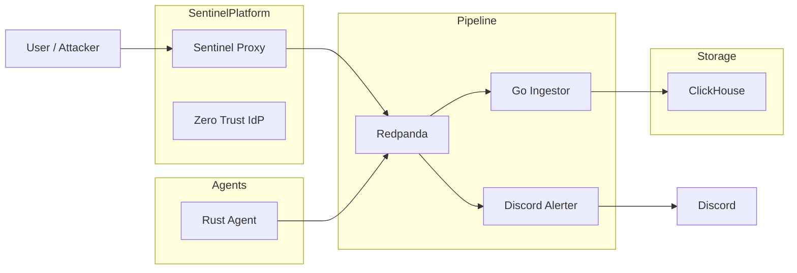

# LumenLog

## Category

Distributed Systems / Security Engineering

---

## Overview

LumenLog is a distributed observability and security event pipeline designed to collect, process, persist, and alert on system activity in real time.

The project combines multiple services written in Go and Rust into a unified logging architecture capable of handling both infrastructure telemetry and security events.

Originally focused on distributed logging, the platform evolved into a lightweight security operations pipeline through integration with Sentinel Platform.

LumenLog now supports:

* real-time security alerting
* identity-aware event tracking
* Discord webhook notifications
* centralized event persistence
* cross-service observability

The system demonstrates how telemetry, security enforcement, and event streaming can work together in a production-style architecture.

---

# Core Idea

Every system generates events.

LumenLog treats those events as a continuous stream that can be:

* collected
* enriched
* filtered
* persisted
* analyzed
* alerted on in real time

Rather than storing logs locally per service, LumenLog centralizes everything into a shared event pipeline.

---

# System Architecture



---

# Architecture Components

## Rust Agent

A lightweight telemetry producer written in Rust.

Responsibilities:

* generate heartbeat events
* serialize logs using Protobuf
* publish messages to Redpanda
* simulate distributed system telemetry

---

## Sentinel Security Bridge

Sentinel Proxy acts as a security event producer.

Responsibilities:

* emit WAF detection events
* emit rate-limit violations
* attach authenticated identity metadata
* forward structured security events into the pipeline

This transforms LumenLog from a general logging system into a security-aware observability platform.

---

## Redpanda Broker

Kafka-compatible event streaming platform used as the system backbone.

Responsibilities:

* receive events from producers
* buffer and distribute streams
* decouple producers from consumers
* support high-throughput event ingestion

---

## Go Ingestor

Consumes binary Protobuf messages from Redpanda.

Responsibilities:

* decode Protobuf events
* normalize structured metadata
* batch writes efficiently
* persist events into ClickHouse

---

## Discord Alerter

Real-time security notification sidecar.

Responsibilities:

* monitor security events
* suppress noise from normal traffic
* trigger Discord alerts only for malicious activity
* provide immediate visibility into attacks

---

## ClickHouse Storage

Column-oriented analytical database.

Responsibilities:

* persist structured logs
* support fast event querying
* enable future dashboards and analytics
* store both telemetry and security data

---

# Security Event Flow

## Example Attack Flow

1. User sends malicious request to Sentinel Proxy
2. WAF detects suspicious pattern
3. Proxy emits structured SECURITY event
4. Event streamed through Redpanda
5. Discord Alerter triggers notification
6. Ingestor stores event in ClickHouse

---

## Example Discord Alert

```text
🚨 SECURITY ALERT

User: bob
Service: sentinel-proxy
Attack: SQL Injection
Action: blocked
Path: /login
IP: 192.168.x.x
```

---

# Core Features

## Real-Time Security Alerting

* Discord webhook integration
* Immediate attack notifications
* Reduced alert spam through intelligent filtering

---

## Identity-Aware Logging

Security events include:

* authenticated username
* anonymous traffic tagging
* service metadata
* attack classification

This creates a full audit trail across the system.

---

## Distributed Event Streaming

* asynchronous architecture
* decoupled services
* producer/consumer pipeline
* scalable event transport

---

## Polyglot System Design

The pipeline intentionally combines:

* Rust producers
* Go services
* Protobuf schemas
* Kafka-compatible infrastructure

This demonstrates interoperability across languages and services.

---

## Structured Security Telemetry

Current event types include:

* SQL injection attempts
* XSS attempts
* rate-limit violations
* blocked admin access
* authentication activity

---

## Containerized Infrastructure

Entire stack runs through Docker Compose.

Services can be launched together using a single command.

---

# Database Schema

## lumen_db.logs

| Column | Type |
|---|---|
| service_name | String |
| host | String |
| level | String |
| message | String |
| timestamp | DateTime64 |
| metadata | Map(String, String) |

---

# Running the System

## Prerequisites

* Docker
* Docker Compose

---

## Start the Stack

```bash
docker compose up --build
```

---

## Stop the Stack

```bash
docker compose down
```

---

## Fresh Reset

```bash
docker compose down -v
```

---

# Current Integration Status

LumenLog currently integrates with:

* Sentinel Proxy
* Zero Trust Identity Provider
* Discord webhook notifications

This version focuses on security event streaming and observability independently from Sentinel OS.

Future versions are planned to integrate directly into the Sentinel OS dashboard for live visualization and analytics.

---

# Tech Stack

* Go
* Rust
* Redpanda
* ClickHouse
* Docker
* Protobuf
* Discord Webhooks

---

# What This Project Demonstrates

This project demonstrates:

* distributed event streaming
* real-time observability pipelines
* security telemetry engineering
* polyglot system architecture
* structured logging design
* asynchronous service communication
* identity-aware security monitoring
* production-style containerized infrastructure

---

# Closing Note

LumenLog started as a distributed logging experiment and evolved into a security-focused observability pipeline.

The project demonstrates how security systems, event streaming, and telemetry infrastructure can operate together as one connected architecture rather than isolated components.